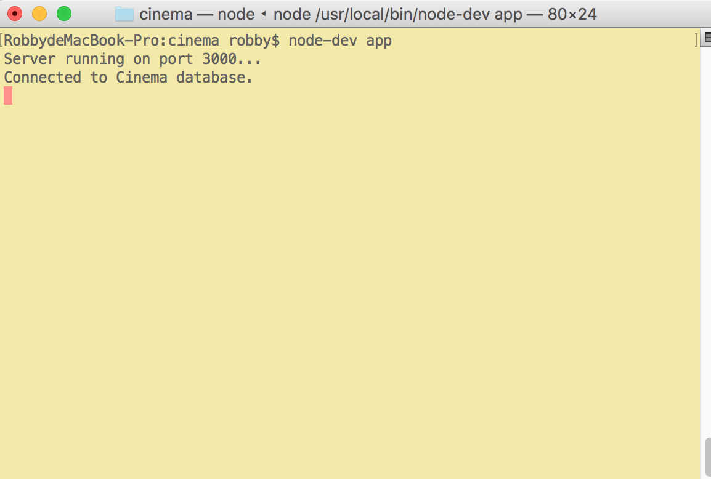

# Cinema
A simple app using AngularJS + express.js + mongodb

## REST API
```localhost:3000/api/movies``` The server will respond with all movies in database in JSON


```localhost:3000/api/movies/xxxxx``` 'xxxxx' is the _id of a certain movie, the server will respond with movie with this id.


## Installing npm and mongodb
Note: If you are running this app for the first time, you need to initialize the database. 
More details plese see './model/movies.js'

## Running server on port 3000
After installing npm and mongodb, open terminal and type
```
npm install
node app
```



## Homepage
Then open the browser and type 'localhost:3000' to visit homepage.


## Add a new favorite
Click 'Add Favorites' on the navigation to add a new film to favorite list, the route will goes to 'localhost:3000/movies/add'

Fill the information in the form then click 'DONE' at the bottom.

## View Details
Click 'View Details' button on homepage to navigate to '/movies/details/[MovieID]'.


## Edit Info
Click 'Edit' button on detail page to navigate to '/movies/edit/[MovieID]'


## Remove from favorites
Click 'Remove' to remove the movie

