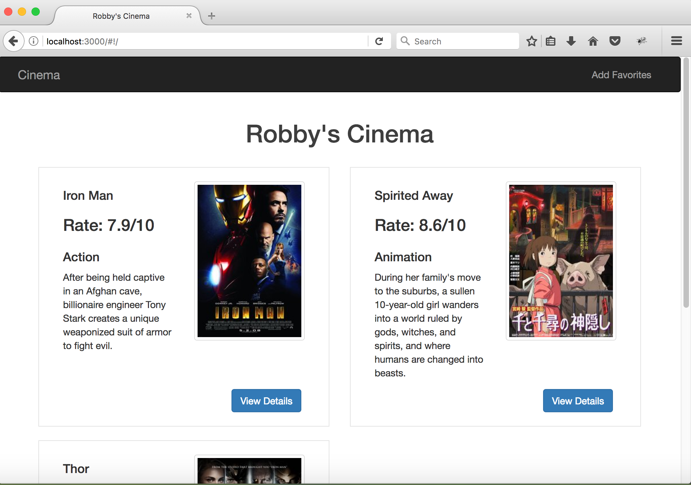

# Cinema
A simple app using AngularJS + express.js + mongodb

===
## Installing npm and mongodb
Note: If you are running this app for the first time, if running the app for the first time, need to initialize the database. 
More details see './model/movies.js'
## Running server on port 3000

After installing npm and mongodb, open terminal and type
```
node install
node app
```
## Homepage

Then open the browser and type 'localhost:3000' to visit homepage.

## Add a new favorite
Click 'Add Favorites' on the navigation to add a new film to favorite list, the route will goes to 'localhost:3000/movies/add'

Fill the information in the form then click 'DONE' at the bottom.

## View Details
Click 'View Details' button on homepage to navigate to '/movies/details/[MovieID]'.


## Edit Info
Click 'Edit' button on detail page to navigate to '/movies/edit/[MovieID]'


## Remove from favorites
